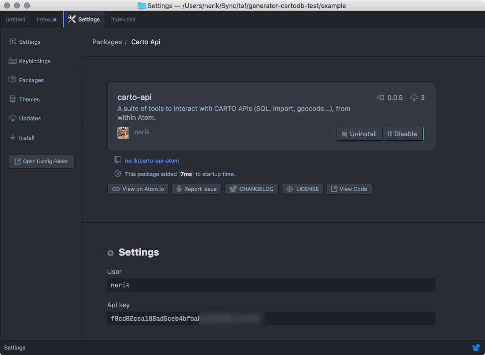

# carto-api-atom
A suite of tools to interact with CARTO APIs (SQL, import, geocode...), from within Atom.


## setup

```
apm install carto-api
```

All of what you can do with this package will require your CARTO username, and most your CARTO api key.
Get your api key from https://[username].carto.com/your_apps, then in Atom, go to carto-api package settings and paste it there:



Api key needed for:
write operations (SQL updates, inserts, etc, and file imports) as well as SQL statements involving quotas (geocoding, routing, etc)
